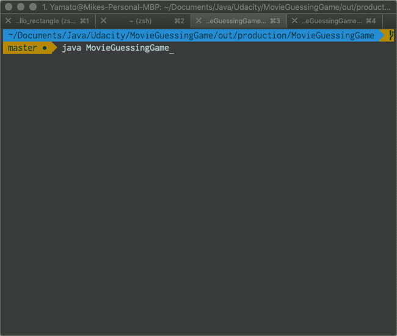

# Movie Guessing Game

A simple Java based guessing game of various movie titles played through the terminal using letters from A to Z. Players can incorrectly guess up to 10 times before they lose.

To play be sure to have a JDK installed. Then navigate to `/out/production/MovieGuessingGame/` and run the command, `java MovieGuessingGame` (uppercase `Java` will also work).

Enjoy!

